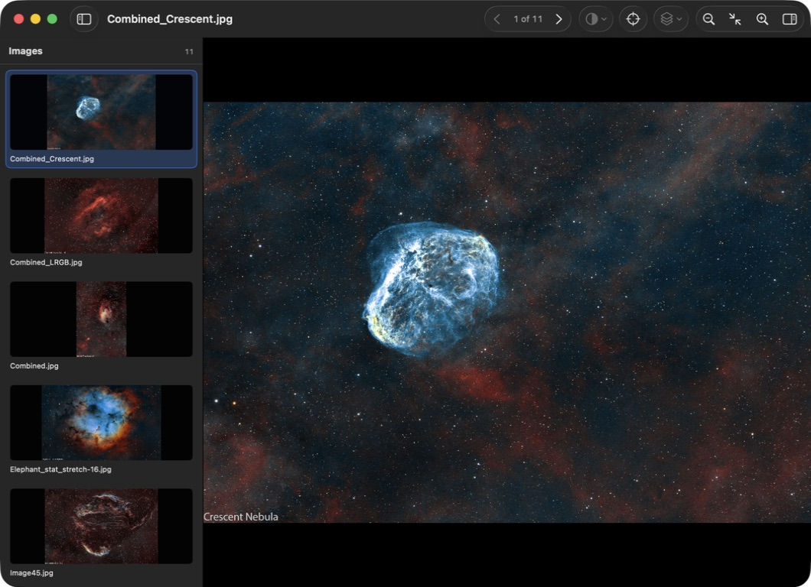
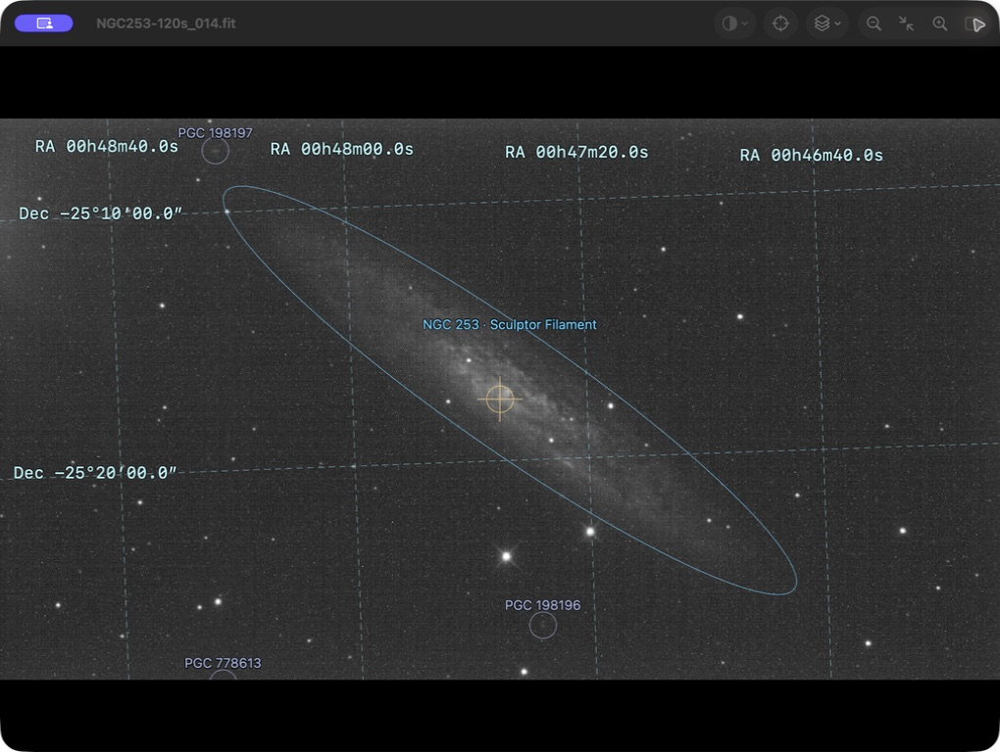
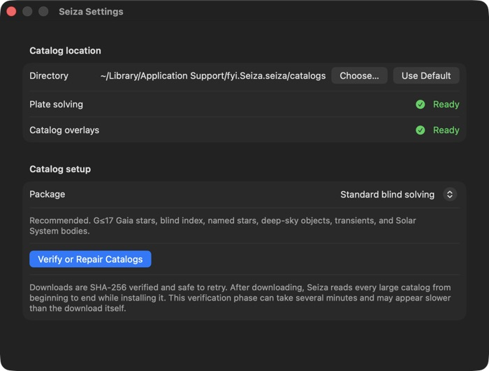

# Seiza for macOS

**A fast, native FITS viewer and plate solver for the Mac.**

Open one image or a whole night of captures. Step through them instantly. Stretch
FITS data, inspect headers, plate-solve a frame, and see the stars and deep-sky
objects in it. Everything runs locally, and Seiza never solves an image until
you ask it to.

[**Download Seiza 0.3.0**](https://github.com/theatrus/seiza-mac/releases/latest/download/Seiza-0.3.0-universal.dmg) · [Release notes and other downloads](https://github.com/theatrus/seiza-mac/releases/latest)





Seiza is a real Mac app built with SwiftUI, AppKit, and the
[Seiza](https://github.com/theatrus/seiza) Rust core. There is no Tauri,
Electron, web view, or local server.

## Feature matrix

| Feature | Status | What you get |
| --- | --- | --- |
| FITS and raster viewing | Available | Open FITS, JPEG, PNG, and TIFF files or drop them onto an existing window. |
| Folder browsing | Available | Browse mixed-format folders with a thumbnail drawer, local thumbnail cache, and arrow-key navigation. |
| FITS display | Available | View mono, planar RGB, and Bayer/OSC data with fast native rendering. |
| Stretch controls | Available | Stack or replace automatic and manual stretches without intermediate 8-bit quantization; undo and redo edits; pick GHS symmetry points from the image; and choose linked, per-channel, or luminance-preserving color handling. |
| Zoom and inspection | Available | Fit to window, pan, pinch around the pointer, and compare pre- and post-stretch histograms alongside headers and statistics. |
| Local plate solving | Available | Run a blind solve only when you press Solve. No image is uploaded. |
| Catalog setup | Available | Download, verify, install, or repair solver catalogs in Settings with visible progress. |
| Solver overlays | Available | Toggle named and field stars, individual deep-sky catalogs, transients, comets, asteroids, detections, coordinate grid, and field center. |
| Object outlines | Available | Draw detailed OpenNGC contours with catalog ellipses as a fallback. |
| Image export | Available | Export the displayed image as PNG, JPEG, or TIFF, with or without the currently visible solve overlays. |
| Finder Quick Look preview | Available | Select a FITS file in Finder and press Space to see a stretched preview without opening Seiza. |
| Finder file support | Available | Register `.fits`, `.fit`, and `.fts` files with a dedicated FITS document icon. |
| Finder icon thumbnails | Planned | Show image content on FITS file icons. Spacebar previews already work through Quick Look. |
| FITS cubes and multiple extensions | Planned | Navigate image planes and HDUs inside one FITS file. |

## Download

[**Download the current DMG**](https://github.com/theatrus/seiza-mac/releases/latest/download/Seiza-0.3.0-universal.dmg), open it, and drag Seiza to Applications.

Seiza requires macOS 15 or newer. The same download runs natively on Apple
silicon and Intel Macs. Release builds are signed with Developer ID and
notarized by Apple.

## Build

Requirements: macOS 15 or newer, Xcode 26, Rust 1.89 or newer, and the Rust
target matching the Mac being built.

```sh
cargo test --workspace
xcodebuild \
  -project Seiza.xcodeproj \
  -scheme Seiza \
  -configuration Debug \
  -derivedDataPath DerivedData \
  CODE_SIGNING_ALLOWED=NO \
  build
```

The unsigned development app is written to:

```text
DerivedData/Build/Products/Debug/Seiza.app
```

Open `Seiza.xcodeproj` to run and sign it with a local development team.

The app and FITS document icons are generated from the checked-in colorful
Seiza website mark. Regenerate them on macOS with:

```sh
swift scripts/generate-app-icons.swift
swift scripts/generate-document-icon.swift
```

## Tests and continuous integration

[](https://github.com/theatrus/seiza-mac/actions/workflows/ci.yml)

The repository exercises the Rust rendering/C ABI with unit tests and the
native application with XCTest. Every pull request checks Rust formatting and
Clippy warnings, runs both test suites, validates the app and extension property
lists, builds a universal Release application, and verifies an unsigned
development DMG. Pull-request jobs have read-only repository access and never
receive signing secrets.

A push to the official `main` branch runs the same checks, then an isolated job
enters the protected `signing` environment. It Developer ID signs and notarizes
the validated app and DMG and uploads `Seiza-latest-main` as a 30-day Actions
artifact. Versioned downloads continue to come from tagged GitHub Releases.

```sh
cargo test --workspace --locked
xcodebuild test \
  -project Seiza.xcodeproj \
  -scheme Seiza \
  -destination 'platform=macOS' \
  -derivedDataPath DerivedData \
  CODE_SIGNING_ALLOWED=NO
```

Tags matching `vMAJOR.MINOR.PATCH` enter the protected `signing` environment,
Developer ID sign and notarize the app and DMG, and publish the universal DMG
and zipped app to GitHub Releases. See [RELEASE.md](RELEASE.md) for the complete
release runbook and [docs/RELEASING.md](docs/RELEASING.md) for credential and
environment setup.

## Catalogs and solving

Previewing images does not require catalog data, and Seiza never starts a solve
until you press Solve. Blind solving any supported FITS or raster image requires
a complete Seiza catalog directory containing a star catalog and blind index.

Open **Seiza > Settings** (`Command-,`), leave **Standard blind solving**
selected, and click **Download and Install Catalogs**. You can use Seiza's
default data location or choose another writable directory. The Settings pane
reports download, installation, and verification progress and may be closed
while setup continues.



Downloads are SHA-256 verified into Seiza's immutable cache. Setup then hard
links those verified files into the selected catalog directory when possible,
avoiding the previous second copy and full hash pass. Cross-filesystem installs
fall back to a verified copy. Setup is safe to retry and reuses cached data.

The equivalent command-line setup is:

```sh
seiza setup
```

or:

```sh
seiza download-data prebuilt --output /path/to/catalogs
```

If you created a catalog directory on the command line, choose that directory
in Seiza's Settings. The sandbox permission is retained as a security-scoped
bookmark. The main object catalog supplies named-star and deep-sky overlays,
`transients.bin` supplies dated transient overlays, and `minor-bodies.bin`
supplies comet and asteroid positions at the FITS acquisition time. Solving and
catalog loading
only begin when the user presses Solve. If the required star catalog or blind
index is missing, Solve explains the problem and links back to Catalog Settings.
Satellite overlays are intentionally deferred.

## Finder integration

Installing Seiza registers FITS files and its Quick Look extension with macOS.
Select a `.fits`, `.fit`, or `.fts` file in Finder and press Space to see a
stretched preview without opening the app.

Always-visible image thumbnails on Finder file icons require a separate
`QLThumbnailProvider` extension and are planned for a later release. Quick Look
previews already work.

See [ARCHITECTURE.md](docs/ARCHITECTURE.md) and [ROADMAP.md](docs/ROADMAP.md).
