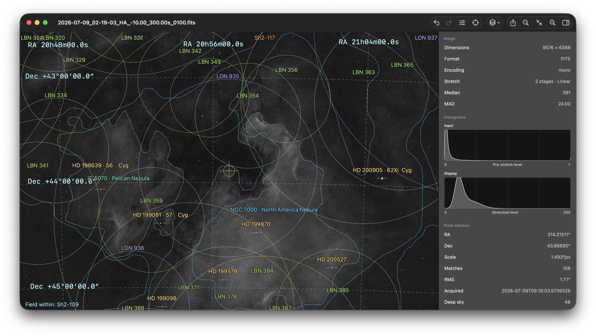
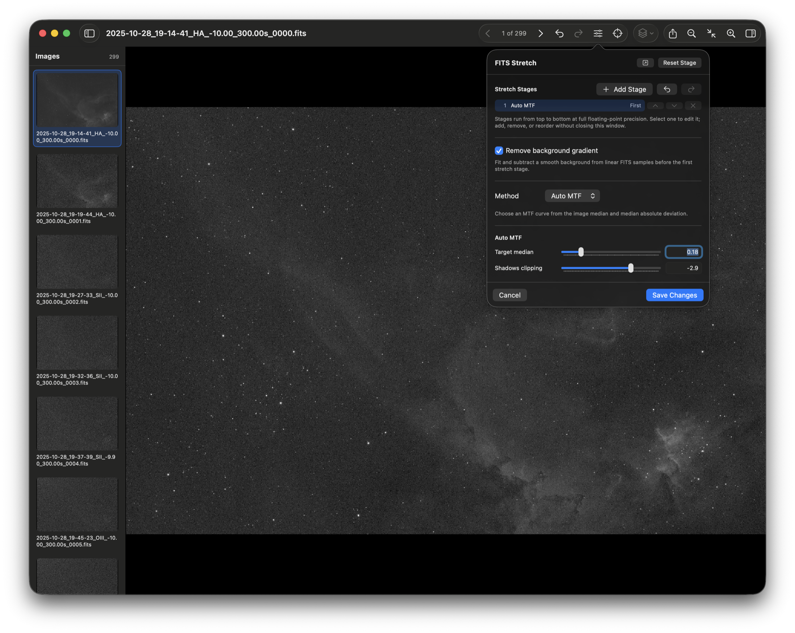
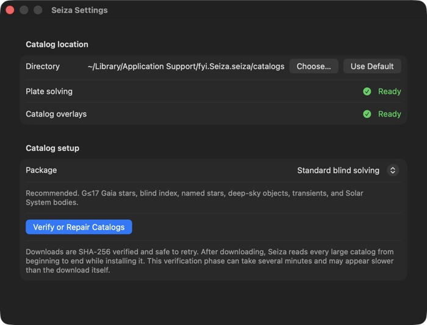

# Seiza for Mac

**A fast, native FITS and XISF viewer and plate solver for the Mac.**

Open one image or a whole night of captures. Step through them instantly. Stretch
FITS or XISF data, inspect headers, plate-solve a frame, and see the stars and deep-sky
objects in it. Everything runs locally, and Seiza never solves an image until
you ask it to.

[**Download Seiza for Mac 0.6.2**](https://github.com/theatrus/seiza-mac/releases/latest/download/Seiza-0.6.2-universal.dmg) · [Release notes and other downloads](https://github.com/theatrus/seiza-mac/releases/latest)

**Also from Seiza:** [Core, CLI, and libraries](https://github.com/theatrus/seiza) ·
[Seiza for Windows](https://github.com/theatrus/seiza-win)

## See what is in the frame

Press Solve when you want sky context. Seiza draws catalog-colored object
outlines, names, stars, and a WCS grid over the image, while the inspector keeps
the input and display histograms and solve quality visible.



## Review a whole night without leaving the viewer

Open a directory, move through hundreds of mixed FITS, XISF, and raster frames with
the arrow keys, and use cached thumbnails to keep the sequence moving. Stretch
controls stay live over the image and can detach into a persistent panel.



[Read the practical guide to browsing, stretching, solving, overlays, and export.](docs/USING-SEIZA.md)

Seiza is a real Mac app built with SwiftUI, AppKit, and the
[Seiza](https://github.com/theatrus/seiza) Rust core. There is no Tauri,
Electron, web view, or local server.

## Features

| Feature | What Seiza does |
| --- | --- |
| FITS, XISF, and raster viewing | Opens FITS, XISF, JPEG, PNG, and TIFF files in native Mac windows. Drop a new file onto any viewer to replace its image. |
| Fast folder review | Browses mixed-format local or network folders without blocking the app, with arrow keys, a thumbnail drawer, a local cache, and nearby-image preloading. |
| Directory stacking | Aligns and combines selected FITS or XISF frames from an open folder. It recognizes common filename filters such as L/R/G/B, Ha, OIII, S/SII, and H-beta, while keeping custom filter names unchanged. Save one stack per detected filter or turn grouping off for one output. Choose references, normalization, sample rejection, registration limits, and optional bias, dark, and flat masters; then follow progress, cancel between frames, and open the saved 32-bit floating-point FITS results. |
| Astronomy rendering | Displays mono, planar RGB, and Bayer/OSC data through the full-precision Seiza core. |
| Live stretch stacks | Adds, removes, reorders, and edits automatic or manual stages. Pick GHS symmetry points from the image, choose linked, per-channel, or luminance-preserving color, copy settings between images, and undo or redo each change. |
| Responsive previews | Renders a quick zoom-aware preview off the main thread, cancels stale work, then replaces it with a source-resolution render. |
| Background correction | Fits automatic, polynomial, or radial-basis gradient models to linear mono or color data. Choose additive subtraction or multiplicative illumination correction, tune the amount, and inspect each change through live preview. |
| Light deconvolution | Applies optional damped Richardson-Lucy restoration with controls for stellar FWHM, strength, noise, and ringing. |
| Image inspection | Fits, zooms, and pans around the pointer; shows source and display histograms; and lets you search or copy image headers. |
| Local plate solving | Blind-solves an image only when you press Solve. It sends no image or catalog data off the Mac. |
| Sky overlays | Toggles named and field stars, each deep-sky catalog, OpenNGC outlines, transients, comets, asteroids, detections, the coordinate grid, and field center. |
| WCS export | Writes a solved image's linear or SIP solution as a standard header-only FITS `.wcs` sidecar. |
| Catalog setup | Downloads, checks, installs, and repairs solver catalogs in Settings with clear progress and cache reuse. |
| Image export and copy | Exports full-size PNG, JPEG, or TIFF files with optional overlays. PNG and TIFF support 16 bits per channel. Full-size clipboard copy keeps visible overlays. |
| Finder previews | Shows stretched FITS and XISF thumbnails in Finder. Space-bar Quick Look keeps the full image centered and fitted as the preview changes size, without opening Seiza. |
| Finder file support | Registers `.fits`, `.fit`, `.fts`, and `.xisf` files with a Seiza document icon. |
| Signed in-app updates | Checks for releases on demand or on a user-controlled schedule, then verifies and installs them with Sparkle. |

## Download

[**Download Seiza for Mac 0.6.2**](https://github.com/theatrus/seiza-mac/releases/latest/download/Seiza-0.6.2-universal.dmg), open it, and drag Seiza to Applications.

Or install with [Homebrew](https://brew.sh) from the
[theatrus/homebrew-seiza tap](https://github.com/theatrus/homebrew-seiza):

```sh
brew install --cask theatrus/seiza/seiza-mac
```

Seiza requires macOS 15 or newer. The same download runs natively on Apple
silicon and Intel Macs. Release builds are signed with Developer ID and
notarized by Apple.

## Build

Requirements: macOS 15 or newer, Xcode 26, Rust 1.89 or newer, and the Rust
target matching the Mac being built.

```sh
cargo test --workspace
xcodebuild \
  -project Seiza.xcodeproj \
  -scheme Seiza \
  -configuration Debug \
  -derivedDataPath DerivedData \
  CODE_SIGNING_ALLOWED=NO \
  build
```

The unsigned development app is written to:

```text
DerivedData/Build/Products/Debug/Seiza.app
```

Open `Seiza.xcodeproj` to run and sign it with a local development team.

The app and astronomy document icons are generated from the checked-in colorful
Seiza website mark. Regenerate them on macOS with:

```sh
swift scripts/generate-app-icons.swift
swift scripts/generate-document-icon.swift
```

## Tests and continuous integration

[](https://github.com/theatrus/seiza-mac/actions/workflows/ci.yml)

The repository exercises the Rust rendering/C ABI with unit tests and the
native application with XCTest. Every pull request checks Rust formatting and
Clippy warnings, runs both test suites, validates all app and extension property
lists, builds a universal Release application, and verifies an unsigned
development DMG. Pull-request jobs have read-only repository access and never
receive signing secrets.

A push to the official `main` branch runs the same checks, then an isolated job
enters the protected `signing` environment. It Developer ID signs and notarizes
the validated app and DMG and uploads `Seiza-latest-main` as a 30-day Actions
artifact. Versioned downloads continue to come from tagged GitHub Releases.

```sh
cargo test --workspace --locked
xcodebuild test \
  -project Seiza.xcodeproj \
  -scheme Seiza \
  -destination 'platform=macOS' \
  -derivedDataPath DerivedData \
  CODE_SIGNING_ALLOWED=NO
```

Tags matching `vMAJOR.MINOR.PATCH` enter the protected `signing` environment,
Developer ID sign and notarize the app and DMG, sign the update ZIP, and
publish the appcast, universal DMG, and zipped app to GitHub Releases. See
[RELEASE.md](RELEASE.md) for the complete release runbook and
[docs/RELEASING.md](docs/RELEASING.md) for credential and environment setup.

## Catalogs and solving

Previewing images does not require catalog data, and Seiza never starts a solve
until you press Solve. Blind solving any supported FITS, XISF, or raster image requires
a complete Seiza catalog directory containing a star catalog and blind index.

Open **Seiza > Settings** (`Command-,`), leave **Standard blind solving**
selected, and click **Download and Install Catalogs**. You can use Seiza's
default data location or choose another writable directory. The Settings pane
reports download, installation, and verification progress and may be closed
while setup continues.



Downloads are SHA-256 verified into Seiza's immutable cache. Setup then hard
links those verified files into the selected catalog directory when possible,
avoiding the previous second copy and full hash pass. Cross-filesystem installs
fall back to a verified copy. Setup is safe to retry and reuses cached data.

The equivalent command-line setup is:

```sh
seiza setup
```

or:

```sh
seiza download-data prebuilt --output /path/to/catalogs
```

If you created a catalog directory on the command line, choose that directory
in Seiza's Settings. The sandbox permission is retained as a security-scoped
bookmark. The main object catalog supplies named-star and deep-sky overlays,
`transients.bin` supplies dated transient overlays, and `minor-bodies.bin`
supplies comet and asteroid positions at the image acquisition time. Solving and
catalog loading
only begin when the user presses Solve. If the required star catalog or blind
index is missing, Solve explains the problem and links back to Catalog Settings.
Satellite overlays are intentionally deferred.

## Finder integration

Seiza registers FITS and XISF files and two Quick Look extensions with macOS.
Finder shows stretched image thumbnails in icon, list, column, and Gallery
views. Select a `.fits`, `.fit`, `.fts`, or `.xisf` file and press Space for a
larger preview without opening Seiza. Finder and Quick Look preserve the image
aspect ratio; Quick Look redraws the whole frame to fit whenever its window
changes size.

See the [usage guide](docs/USING-SEIZA.md),
[architecture](docs/ARCHITECTURE.md), and [roadmap](docs/ROADMAP.md).
