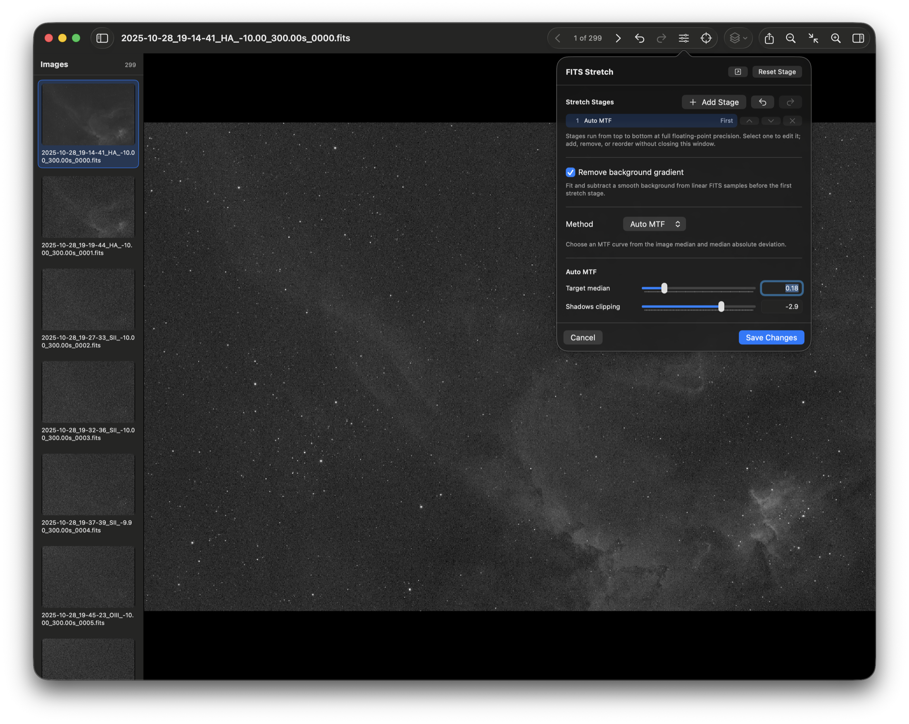
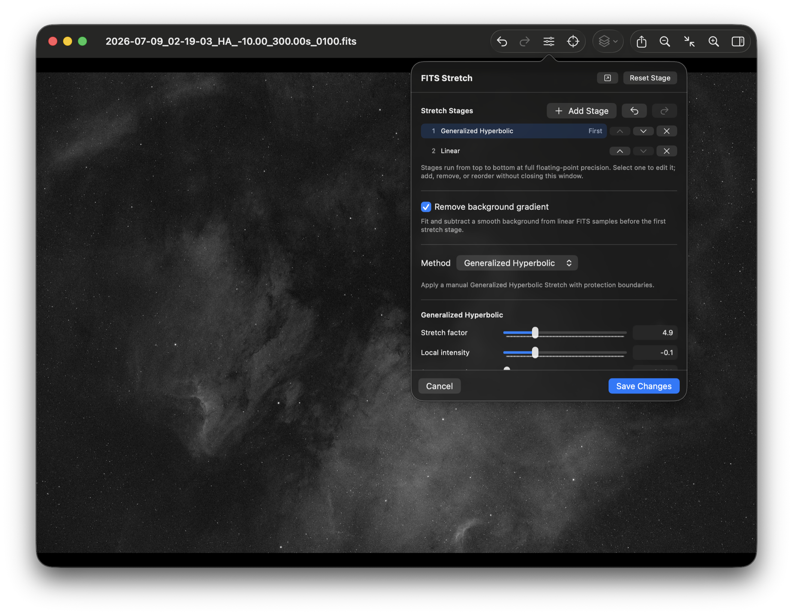
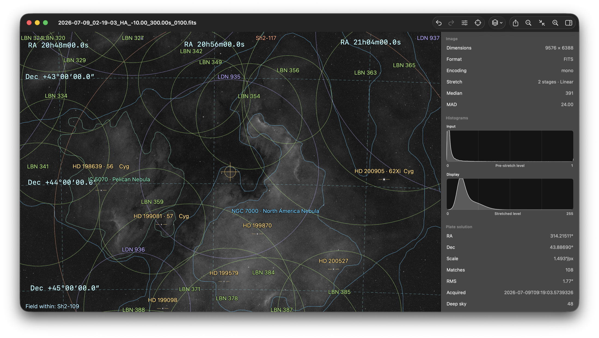
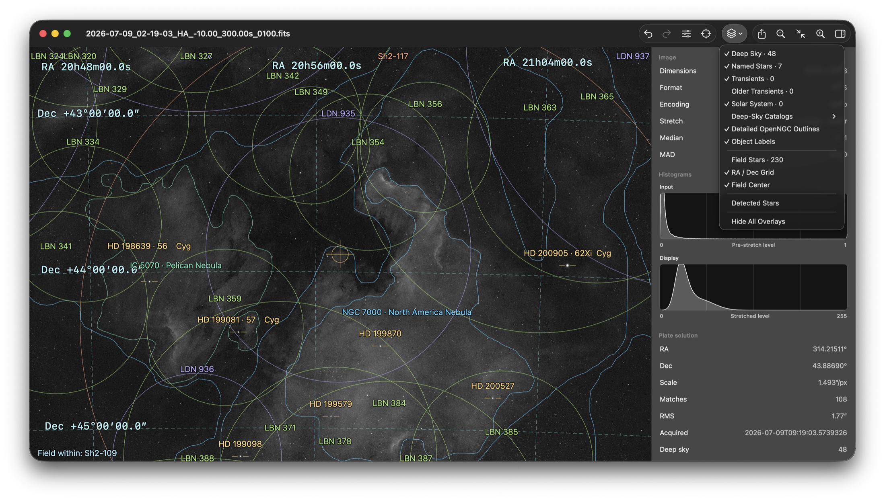

# Using Seiza

Seiza is built for two jobs: moving quickly through real observing data and
getting trustworthy sky context when you ask for it. Image loading, stretching,
catalog access, and solving all stay on the Mac.

The screenshots in this guide show the current unreleased `main` build. The
downloadable v0.3.0 release and current `main` are compared in the
[README feature matrix](../README.md#feature-matrix).

## Open one image or a directory

Choose **File > Open** and select a FITS, XISF, JPEG, PNG, or TIFF image. You can also
select a directory or drop a new image or directory onto an existing viewer
window.

Directory windows include a thumbnail drawer and accept the left and right
arrow keys. Seiza caches thumbnails locally and preloads nearby entries, so
moving through a long sequence does not require each thumbnail to be decoded
again. A directory may mix FITS, XISF, and ordinary raster images. The last
committed astronomy processing recipe carries forward as you move between
frames, so a stack
chosen for one exposure becomes the starting point for the next. Automatic
stages still measure every image independently. The stretch undo and redo
timeline follows the recipe through the directory, so moving to another frame
does not discard your recent adjustments.

Use **Edit > Copy Adjustments** (**Shift-Command-C**) and **Paste Adjustments**
(**Shift-Command-V**) to move the complete committed recipe between non-adjacent
frames or separate Seiza windows. The clipboard includes the stretch stack,
background extraction, and deconvolution settings; pasting is one undoable edit.

The viewer starts each image fitted to the available window. Pinch around the
pointer to zoom, drag or scroll to pan, and press **Command-0** to fit again.

## Build an astronomy stretch

Click the **Stretch** toolbar button to open the compact editor. Stages run from
top to bottom and keep floating-point data between them; Seiza only makes an
8-bit display image after the final stage.

In the live stack editor you can:

- add another stage without closing the editor;
- select any existing stage and edit its method or parameters;
- move a stage earlier or later with the arrow controls;
- remove a stage with its × button;
- undo or redo committed stretch changes;
- copy and paste committed adjustments between images or windows;
- subtract a smooth background gradient before the first stage; and
- open the same editor in a persistent, resizable utility panel with the
  pop-out button.

The toolbar, stretch panel, and **Edit > Undo Stretch / Redo Stretch** use the
same per-window history. Their enabled state stays synchronized as you edit or
move between directory frames, and the menu owns the standard **Command-Z** and
**Shift-Command-Z** shortcuts.

Automatic methods include Auto MTF and Percentile Asinh. Manual methods include
Linear, Asinh, Midtones Transfer, and Generalized Hyperbolic Stretch (GHS). GHS
can sample its symmetry point directly from the displayed image. Color FITS or XISF
data can use linked channels, independent channels, or luminance-preserving
color handling.

Edits are debounced and rendered away from the main thread. The responsive pass
uses enough pixels for the current zoom and Retina display, then immediately
refines the same draft at source resolution. Newer edits cancel obsolete queued
work. Once that refinement is ready, **Save Changes** commits it directly as one
undoable operation; **Cancel** returns to the committed image.

Seiza also offers **Apply light deconvolution** in the same linear-processing
section. Enable it only when you have measured the FWHM of
unsaturated stars in source-image pixels. Seiza applies background correction
first, then conservative damped Richardson–Lucy restoration, then the display
stretch. The default four iterations and 35% amount are deliberately light;
larger values can amplify noise or draw dark rings around stars. The responsive
pass scales the PSF for its working resolution; its full-resolution refinement
uses the measured source-pixel value. Deconvolution never runs unless the toggle
is on.

## Read the image before and after stretching

Open the inspector with the right-sidebar toolbar button. For FITS and XISF images it
shows dimensions, encoding, full input statistics, the active stretch,
background removal, deconvolution settings, and paired histograms:

- **Input** is computed from normalized linear samples before stretching.
- **Display** is computed from the rendered display pixels after the complete
  stretch stack.

The plots suppress the visual dominance of clipped endpoint bins without
changing the recorded counts. This makes the useful distribution readable
while preserving the distinction between input data and display output.

Image headers can be filtered by keyword or value. **Copy Visible** writes the
filtered rows to the clipboard as plain `KEY = value` lines. After a solve, the
same inspector shows elapsed time, detected and matched star counts, WCS
quality, and overlay diagnostics.

## Solve only when you ask

Seiza does not solve while opening, browsing, stretching, or exporting an
image. Press **Solve** when you want a WCS solution and catalog context. The
inspector then reports the field center, pixel scale, match count, RMS error,
acquisition time, and overlay counts.

Solving requires a local Seiza catalog directory. Open **Seiza > Settings**,
choose the standard package, and use **Download and Install Catalogs**. Setup
reports manifest, download, verification, installation, and completion
progress. Settings also reports the status and path of the star catalog, blind
index, deep-sky objects, transients, and minor bodies. See
[Catalogs and solving](../README.md#catalogs-and-solving) for the data layout
and command-line equivalents.

## Choose the sky context you need

After a successful solve, the **Overlays** menu controls each layer without
rerunning the solver. Available layers include:

- named and field stars;
- individual deep-sky catalogs and object labels;
- detailed OpenNGC outlines;
- current and older transients;
- acquisition-time comets and asteroids;
- the RA/Dec grid and field center; and
- detected image stars.

Catalog colors and outline styling match Seiza Server. Catalog association is
sky-coordinate context, not a claim that an object is visibly detected in the
pixels. Satellite overlays are not included yet.

## Export the result

Choose **File > Export** or press **Shift-Command-E**. Seiza writes PNG, JPEG,
or TIFF at the source image dimensions. PNG and TIFF default to 16 bits per
channel, with an 8-bit option; JPEG is always 8-bit. You can export the image by
itself or include the currently visible solve overlays without reducing a
16-bit export to 8-bit. A 16-bit export is rendered directly from the committed
full-precision processing stack even when a smaller live preview is on screen.

Choose **Edit > Copy Image** or press **Command-C** while the viewer has focus to
place the full source-resolution displayed image on the Mac clipboard as PNG and
TIFF. Visible solve overlays are composited exactly as they appear in the
viewer. If a live stretch refinement is still running, Seiza waits for its
full-resolution pass instead of copying the temporary bounded preview.

## Finder Quick Look

After installing a build from current `main`, select a `.fits`, `.fit`, `.fts`, or
`.xisf` file in Finder and press Space. The bundled Quick Look extension makes
a bounded stretched preview
without launching the full viewer or opening solver catalogs.
